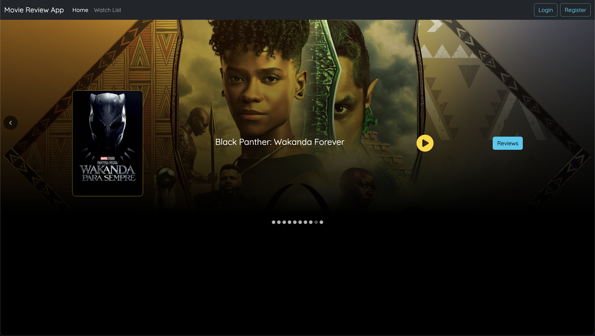
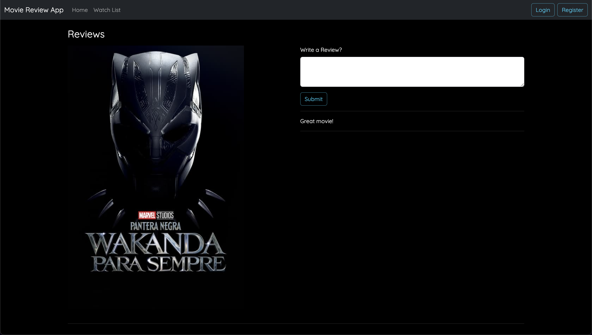
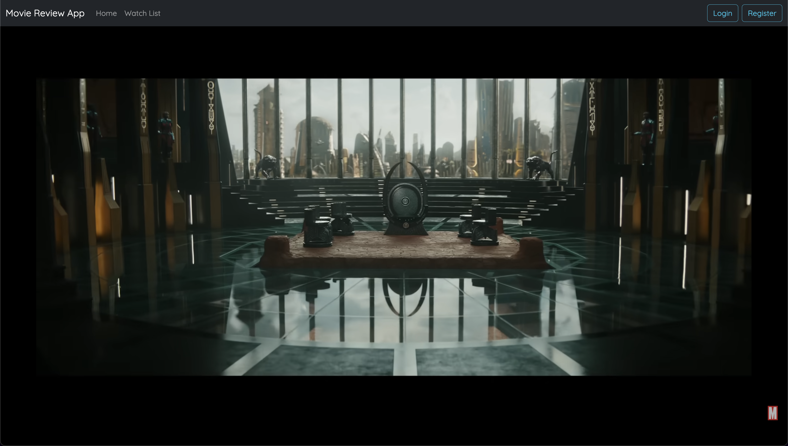
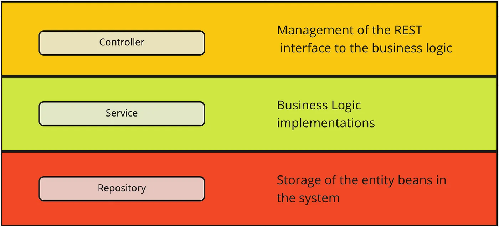

# Movie Review App

A web application for users to watch movie trailers, and read and write movie reviews.

## Home page


## Review page


## Trailer page


## How to run the app
1. Run ```MoviesApplication``` to start the server app
2. Deploy the app online with ```ngrok http 8080``` command, and configure Axios with the domain
3. Start development server with ```npm start``` command

## Tech stack
- Backend: Java, Spring Boot, MongoDB
- Frontend: React, Bootstrap, Axios
- Tools: IntelliJ IDEA, VS Code, MongoDB Compass, MongoDB Atlas, Postman, ngrok

## Learning and accomplishments
- I learned about the Controller-Service-Repository pattern and how to implement it
- I learned about interfacing MongoDB using the Spring Framework via the Repository layer
- I learned how to utilize Axios for HTTP ```GET``` and ```POST``` requests at API endpoints
- I learned how to utilize React ```useEffect``` hook for event handling
- I am proud of quickly learning how to implement a REST API using Java and Spring Boot
- I am proud of implementing a dynamic and aesthetic frontend using React and Bootstrap

## Backend Architecture


## Resources
- https://start.spring.io/
- https://ngrok.com/docs/
- https://react.dev/reference/react
- https://www.npmjs.com/package/react-player
- https://tom-collings.medium.com/controller-service-repository-16e29a4684e5